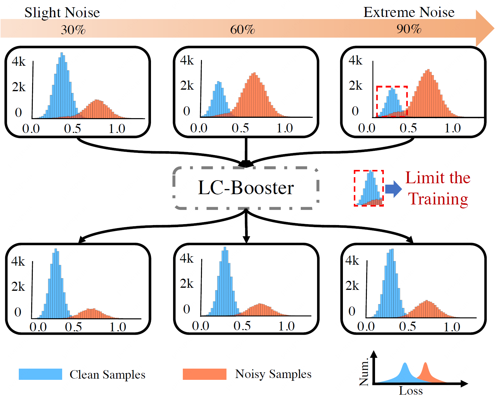

# Reliable Label Correction is a Good Booster When Learning with Extremely Noisy Labels
This is the official implementation of [LC-Booster](https://arxiv.org/abs/2205.00186).

<p align="center">
    
</p>

## Environment
1.  Install `pytorch>=1.7.0` and `torchvision`.
2. `pip install -r requirements.txt`

## Datasets
Please download and organize the datasets in this structure:
```
LC-Booster
├── data/
    ├── cifar-10-batches-py/
    ├── cifar-100-python/
```

## Train
```
# CIFAR-10; 2 GPUs by default
python train_ww_ws.py configs/cifar10/sym80_ww_ws.py
python train_ww_ws.py configs/cifar10/sym90_ww_ws.py

# CIFAR-100; 2 GPUs by default
python train_wwss.py configs/cifar100/sym80_wwss.py
python train_wwss.py configs/cifar100/sym90_wwss.py
```

## Results
We provide results and logs produced by this code.

### CIFAR-10

<table><tbody>
<!-- TABLE HEADER -->
<th align="left">Method</th>
<th align="left">Metric</th>
<th align="left" colspan="4">Noisy Type\Ratio</th>
<!-- TABLE BODY -->

<tr>
<td align="center"></td>
<td align="center"></td>
<td align="center">sym80</td>
<td align="center">sym90</td>
</tr>

<tr>
<td align="left" rowspan="2">SOTA</td>
<td align="left">Best</td>
<td align="center">93.8</td>
<td align="center">91.9</td>
</tr>

<tr>
<td align="left">Last 5</td>
<td align="center">93.6</td>
<td align="center">91.8</td>
</tr>

<tr>
<td align="left" rowspan="2">LC-Booster</td>
<td align="left">Best</td>
<td align="center"><a href="https://drive.google.com/file/d/10iep17T3Ks1g1jcKIbMOMvzJDImBN5rp/view?usp=sharing">94.9</a></td>
<td align="center"><a href="https://drive.google.com/file/d/1-kEgb99dIR-pJ7G0z_6Hop-08xTJsZGd/view?usp=sharing">93.2</a></td>
</tr>

<tr>
<td align="left">Last 5</td>
<td align="center"><a href="https://drive.google.com/file/d/10iep17T3Ks1g1jcKIbMOMvzJDImBN5rp/view?usp=sharing">94.7</a></td>
<td align="center"><a href="https://drive.google.com/file/d/1-kEgb99dIR-pJ7G0z_6Hop-08xTJsZGd/view?usp=sharing">92.9</a></td>
</tr>
</tbody></table>

### CIFAR-100
<table><tbody>
<!-- TABLE HEADER -->
<th align="left">Method</th>
<th align="left">Metric</th>
<th align="left" colspan="4">Noisy Type\Ratio</th>
<!-- TABLE BODY -->

<tr>
<td align="left"></td>
<td align="left"></td>
<td align="center">sym80</td>
<td align="center">sym90</td>
</tr>

<tr>
<td align="left" rowspan="2">SOTA</td>
<td align="left">Best</td>
<td align="center">66.4</td>
<td align="center">41.2</td>
</tr>

<tr>
<td align="left">Last 5</td>
<td align="center">66.1</td>
<td align="center">40.9</td>
</tr>

<tr>
<td align="left" rowspan="2">LC-Booster</td>
<td align="left">Best</td>
<td align="center"><a href="https://drive.google.com/file/d/1HCuvhqnOu1cRr2dcn1hqiWMWqzb4cx56/view?usp=sharing">67.9</a></td>
<td align="center"><a href="https://drive.google.com/file/d/1h05jO0kCTrYAk8aGbsH9LFPpI-Aj5Y4e/view?usp=sharing">50.9</a></td>
</tr>

<tr>
<td align="left">Last 5</td>
<td align="center"><a href="https://drive.google.com/file/d/1HCuvhqnOu1cRr2dcn1hqiWMWqzb4cx56/view?usp=sharing">67.5</a></td>
<td align="center"><a href="https://drive.google.com/file/d/1h05jO0kCTrYAk8aGbsH9LFPpI-Aj5Y4e/view?usp=sharing">50.7</a></td>
</tr>
</tbody></table>

We do observe some variance on results of high noise ratio (e.g., CIFAR-10 sym90), 
as in the implementation of other noisy-label methods (e.g., [AugDesc](https://github.com/KentoNishi/Augmentation-for-LNL)). 
We find the variance is mainly reflected on the first 100 epochs. 
So you can run several first 100 epochs with different seeds and resume from the best one to avoid full training many times.

More configs and code coming soon.
